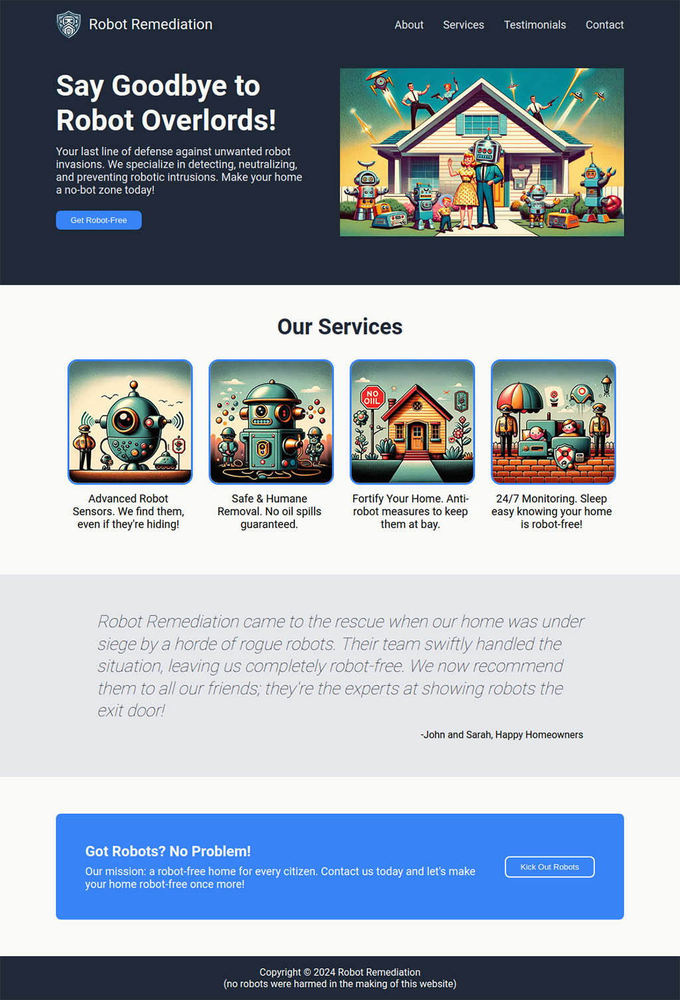

# Project: Landing Page

Repository for a landing page project from the Odin Foundation course. The task was to build a page from scratch using Flexbox, based on a provided design.

## Links
Live demo - https://dcmalk.github.io/odin-landing-page/

Project details - https://www.theodinproject.com/lessons/foundations-landing-page

## Screenshot

## Image Credits
All images created using DALL-E 3.

